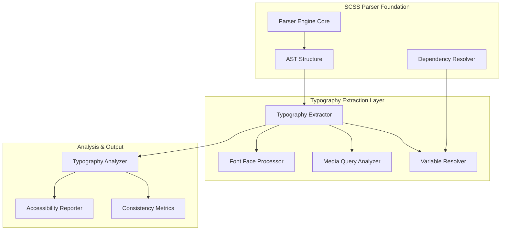
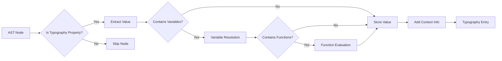
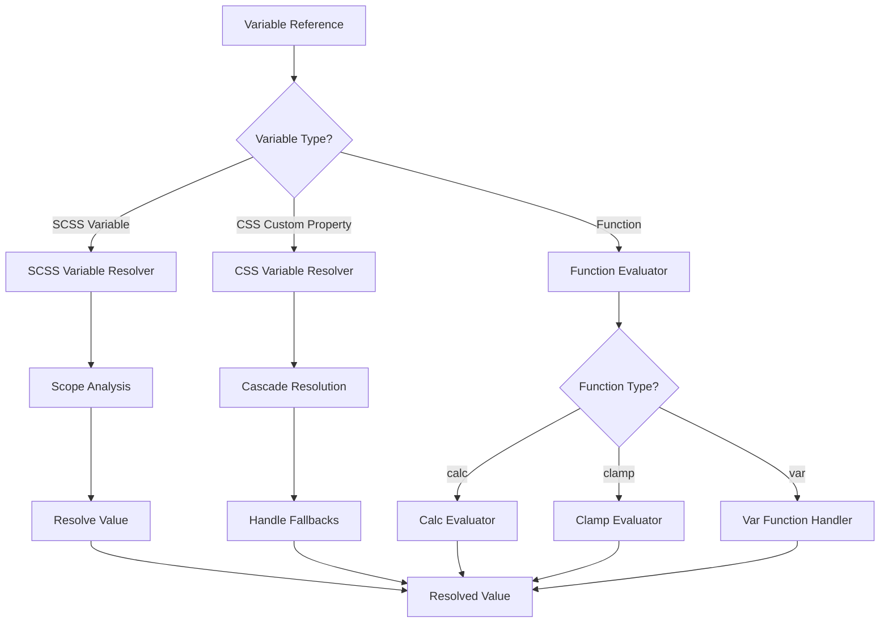
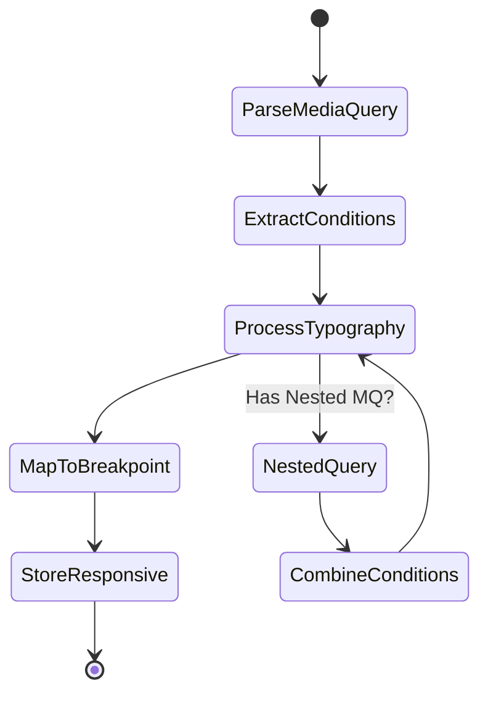
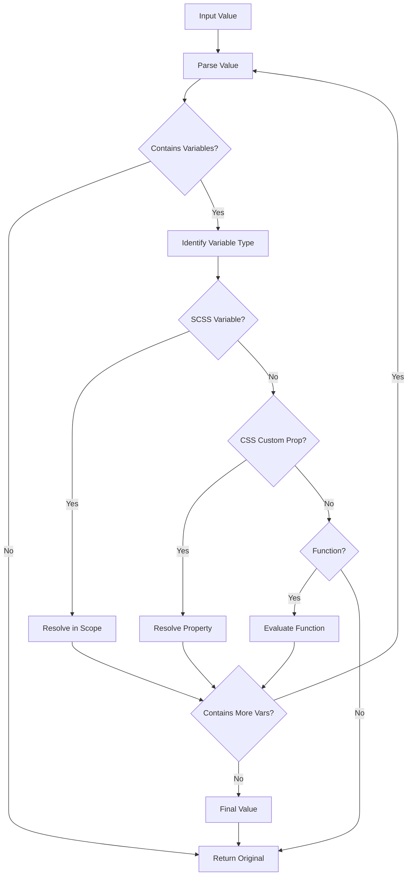
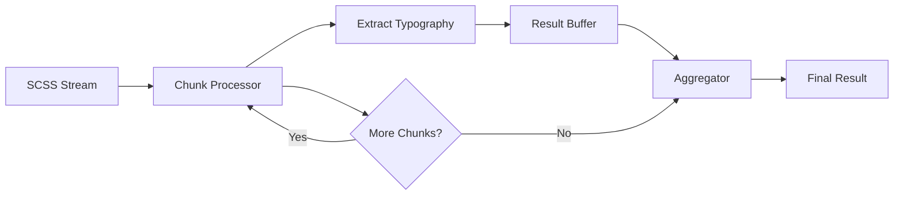
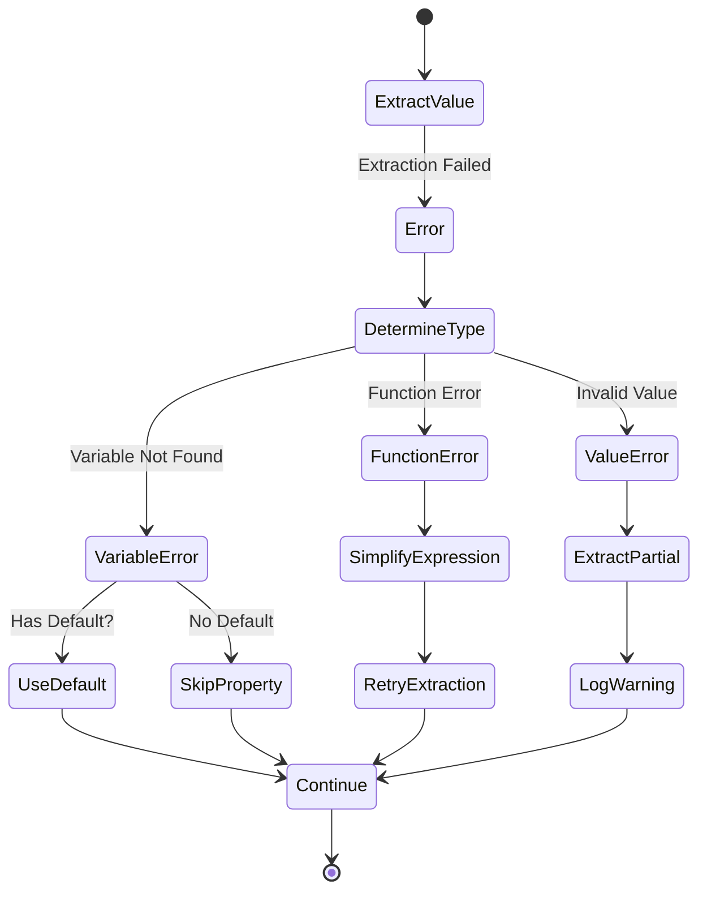
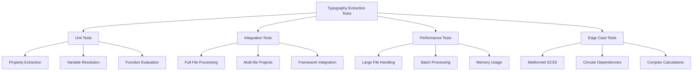

# Typography Property Extraction - Implementation Specification

## Executive Summary

This document provides the implementation specification for extracting typography-related properties from SCSS files 
to support accessibility review and consistency analysis. Building upon the SCSS Parser Architecture (story1-2.md), 
this specification details the extraction engine, data models, and analysis capabilities required to comprehensively 
capture typography information across responsive breakpoints and SCSS-specific features.

## System Architecture Overview

### Component Integration



## Core Components

### 1. Typography Extractor Engine

**Primary Responsibilities:**
- Traverse AST to identify typography-related properties
- Resolve SCSS variables and expressions to concrete values
- Track property inheritance through nested selectors
- Handle responsive variations across breakpoints

**Extraction Strategy:**



### 2. Typography Property Definitions

**Core Typography Properties:**

```typescript
interface TypographyPropertyMap {
  // Font Properties
  'font-family': FontFamilyExtractor;
  'font-size': FontSizeExtractor;
  'font-weight': FontWeightExtractor;
  'font-style': FontStyleExtractor;
  'font-variant': FontVariantExtractor;
  'font-stretch': FontStretchExtractor;
  'font': ShorthandFontExtractor;
  
  // Text Properties
  'line-height': LineHeightExtractor;
  'letter-spacing': LetterSpacingExtractor;
  'word-spacing': WordSpacingExtractor;
  'text-transform': TextTransformExtractor;
  'text-decoration': TextDecorationExtractor;
  'text-align': TextAlignExtractor;
  'text-indent': TextIndentExtractor;
  
  // Advanced Typography
  'font-feature-settings': FontFeatureExtractor;
  'font-variant-numeric': FontVariantNumericExtractor;
  'font-variant-ligatures': FontVariantLigaturesExtractor;
  'font-kerning': FontKerningExtractor;
  
  // CSS Custom Properties
  '--*': CustomPropertyExtractor; // Pattern matching for custom properties
}
```

### 3. Variable Resolution System

**Resolution Pipeline:**



**Variable Resolution Context:**

```typescript
interface VariableResolutionContext {
  // SCSS Variables
  scssVariables: Map<string, SCSSVariableDefinition>;
  
  // CSS Custom Properties
  customProperties: Map<string, CSSCustomProperty>;
  
  // Scope Information
  currentScope: ScopeContext;
  globalScope: ScopeContext;
  
  // Import context
  importedVariables: Map<string, ImportedVariable>;
  
  // Resolution options
  options: {
    resolveToComputed: boolean;
    preserveOriginal: boolean;
    trackDependencies: boolean;
  };
}
```

### 4. Media Query Analysis

**Responsive Typography Tracking:**

```typescript
interface MediaQueryContext {
  // Breakpoint Information
  breakpoint: {
    type: 'min-width' | 'max-width' | 'range';
    value: string;
    unit: 'px' | 'em' | 'rem' | 'vw';
    numericValue: number;
  };
  
  // Combined conditions
  conditions: MediaCondition[];
  
  // Typography overrides
  typographyOverrides: TypographyProperty[];
  
  // Specificity and cascade
  specificity: number;
  order: number;
}

interface ResponsiveTypographyMap {
  // Base styles (no media query)
  base: TypographyProperties;
  
  // Breakpoint-specific styles
  breakpoints: Map<string, TypographyProperties>;
  
  // Computed cascade
  cascade: TypographyCascade[];
}
```

**Media Query Processing Flow:**



### 5. Font Face Declaration Processor

**@font-face Extraction Model:**

```typescript
interface FontFaceDeclaration {
  // Font identification
  fontFamily: string;
  
  // Source information
  sources: FontSource[];
  
  // Font descriptors
  descriptors: {
    weight?: string | string[];
    style?: string;
    stretch?: string;
    unicodeRange?: string[];
    featureSettings?: string;
    variationSettings?: string;
    display?: 'auto' | 'block' | 'swap' | 'fallback' | 'optional';
  };
  
  // Loading information
  loading: {
    strategy: string;
    priority: number;
  };
  
  // Source location
  location: SourceLocation;
}

interface FontSource {
  url: string;
  format?: string;
  tech?: string[];
  isLocal: boolean;
  resolvedPath?: string;
}
```

## Data Models

### 1. Typography Entry Model

```typescript
interface TypographyEntry {
  // Identification
  id: string;
  selector: string;
  property: TypographyProperty;
  
  // Values
  value: {
    original: string;
    resolved: string;
    computed?: ComputedValue;
    fallbacks?: string[];
  };
  
  // Context
  context: {
    file: string;
    location: SourceLocation;
    scope: ScopeInfo;
    specificity: number;
    mediaQuery?: MediaQueryContext;
    parentSelectors: string[];
  };
  
  // Dependencies
  dependencies: {
    variables: string[];
    mixins: string[];
    imports: string[];
    customProperties: string[];
  };
  
  // Metadata
  metadata: {
    isResponsive: boolean;
    hasVariables: boolean;
    hasFunctions: boolean;
    isInherited: boolean;
    overrides: string[];
  };
}
```

### 2. Typography Analysis Result

```typescript
interface TypographyAnalysisResult {
  // Summary statistics
  summary: {
    totalProperties: number;
    uniqueFonts: number;
    responsiveProperties: number;
    customProperties: number;
    fontFaceDeclarations: number;
  };
  
  // Extracted data
  typography: {
    entries: TypographyEntry[];
    fontFaces: FontFaceDeclaration[];
    customProperties: CustomPropertyDefinition[];
  };
  
  // Organized views
  byProperty: Map<TypographyProperty, TypographyEntry[]>;
  bySelector: Map<string, TypographyEntry[]>;
  byBreakpoint: Map<string, TypographyEntry[]>;
  
  // Font stacks
  fontStacks: FontStackAnalysis[];
  
  // Consistency metrics
  consistency: ConsistencyReport;
  
  // Accessibility insights
  accessibility: AccessibilityInsights;
}
```

### 3. Font Stack Analysis

```typescript
interface FontStackAnalysis {
  // Primary font
  primaryFont: string;
  
  // Fallback chain
  fallbackChain: string[];
  
  // Generic fallback
  genericFallback?: 'serif' | 'sans-serif' | 'monospace' | 'cursive' | 'fantasy';
  
  // Usage statistics
  usage: {
    selectors: string[];
    count: number;
    percentage: number;
  };
  
  // Font loading
  fontFace?: FontFaceDeclaration;
  isWebFont: boolean;
  
  // Validation
  validation: {
    hasGenericFallback: boolean;
    fallbackCount: number;
    recommendedFallbacks?: string[];
  };
}
```

## Extraction Algorithms

### 1. Variable Resolution Algorithm

```typescript
interface VariableResolver {
  resolve(
    value: string,
    context: VariableResolutionContext
  ): ResolvedValue;
  
  // Specific resolvers
  resolveSCSSVariable(
    varName: string,
    context: VariableResolutionContext
  ): string | null;
  
  resolveCustomProperty(
    propertyName: string,
    context: VariableResolutionContext,
    fallback?: string
  ): string;
  
  // Function evaluation
  evaluateCalc(
    expression: string,
    context: VariableResolutionContext
  ): ComputedValue;
  
  evaluateClamp(
    min: string,
    val: string,
    max: string,
    context: VariableResolutionContext
  ): ComputedValue;
}
```

**Resolution Strategy:**



### 2. Calc() Function Evaluation

```typescript
interface CalcEvaluator {
  // Parse calc expression
  parseExpression(calc: string): CalcAST;
  
  // Evaluate with units
  evaluate(
    ast: CalcAST,
    context: EvaluationContext
  ): {
    value: number;
    unit: string;
    confidence: 'exact' | 'approximate' | 'unknown';
  };
  
  // Handle unit conversions
  convertUnits(
    value: number,
    fromUnit: string,
    toUnit: string,
    context: UnitConversionContext
  ): number;
}

interface CalcAST {
  type: 'binary' | 'unary' | 'value' | 'function';
  operator?: '+' | '-' | '*' | '/';
  left?: CalcAST;
  right?: CalcAST;
  value?: string | number;
  unit?: string;
}
```

### 3. Responsive Typography Aggregation

```typescript
interface ResponsiveAggregator {
  // Aggregate typography across breakpoints
  aggregate(
    entries: TypographyEntry[]
  ): ResponsiveTypographyMap;
  
  // Build cascade order
  buildCascade(
    breakpoints: MediaQueryContext[]
  ): BreakpointCascade;
  
  // Compute effective styles
  computeEffectiveStyles(
    viewport: ViewportSize,
    cascade: TypographyCascade
  ): TypographyProperties;
}
```

## Performance Optimizations

### 1. Caching Strategy

```typescript
interface TypographyCache {
  // Variable resolution cache
  variableCache: Map<string, ResolvedValue>;
  
  // Function evaluation cache
  functionCache: Map<string, ComputedValue>;
  
  // Selector typography cache
  selectorCache: Map<string, TypographyEntry[]>;
  
  // Cache invalidation
  invalidate(reason: InvalidationReason): void;
}
```

### 2. Streaming Extraction



## Integration Interfaces

### 1. Extractor API

```typescript
interface TypographyExtractor {
  // Main extraction method
  extract(
    ast: SCSSNode,
    options?: ExtractionOptions
  ): Promise<TypographyAnalysisResult>;
  
  // Streaming extraction
  extractStream(
    astStream: ReadableStream<SCSSNode>,
    options?: ExtractionOptions
  ): ReadableStream<TypographyEntry>;
  
  // Specific extractors
  extractFontFaces(ast: SCSSNode): FontFaceDeclaration[];
  extractCustomProperties(ast: SCSSNode): CustomPropertyDefinition[];
  
  // Configuration
  configure(config: ExtractorConfiguration): void;
}

interface ExtractionOptions {
  // Resolution options
  resolveVariables: boolean;
  evaluateFunctions: boolean;
  computeValues: boolean;
  
  // Filtering
  propertyFilter?: TypographyProperty[];
  selectorFilter?: RegExp;
  
  // Performance
  parallel: boolean;
  cacheResults: boolean;
  
  // Output
  includeContext: boolean;
  includeMetadata: boolean;
}
```

### 2. Analysis API

```typescript
interface TypographyAnalyzer {
  // Analyze extracted typography
  analyze(
    entries: TypographyEntry[]
  ): TypographyAnalysisResult;
  
  // Specific analyses
  analyzeConsistency(entries: TypographyEntry[]): ConsistencyReport;
  analyzeAccessibility(entries: TypographyEntry[]): AccessibilityInsights;
  analyzeResponsiveness(entries: TypographyEntry[]): ResponsivenessReport;
  
  // Custom analysis plugins
  registerAnalyzer(
    name: string,
    analyzer: CustomAnalyzer
  ): void;
}
```

## Error Handling

### 1. Extraction Error Types

```typescript
enum ExtractionErrorType {
  INVALID_PROPERTY_VALUE = 'INVALID_PROPERTY_VALUE',
  VARIABLE_NOT_FOUND = 'VARIABLE_NOT_FOUND',
  CIRCULAR_DEPENDENCY = 'CIRCULAR_DEPENDENCY',
  FUNCTION_EVALUATION_ERROR = 'FUNCTION_EVALUATION_ERROR',
  MALFORMED_FONT_FACE = 'MALFORMED_FONT_FACE',
  UNSUPPORTED_SYNTAX = 'UNSUPPORTED_SYNTAX'
}

interface ExtractionError {
  type: ExtractionErrorType;
  message: string;
  location: SourceLocation;
  property?: string;
  value?: string;
  recovery?: RecoveryStrategy;
}
```

### 2. Recovery Strategies



## Output Formats

### 1. JSON Output Schema

```json
{
  "version": "1.0.0",
  "timestamp": "2025-06-03T10:00:00Z",
  "summary": {
    "filesProcessed": 50,
    "totalTypographyProperties": 1234,
    "uniqueFontFamilies": 5,
    "responsiveBreakpoints": 3,
    "customProperties": 25,
    "extractionTime": 2500
  },
  "typography": {
    "fonts": [
      {
        "family": "Inter",
        "fallbacks": ["system-ui", "sans-serif"],
        "usage": {
          "count": 145,
          "selectors": [".body", ".content"]
        }
      }
    ],
    "sizes": {
      "base": {
        "small": "0.875rem",
        "medium": "1rem",
        "large": "1.25rem"
      },
      "responsive": {
        "768px": {
          "small": "1rem",
          "medium": "1.125rem",
          "large": "1.5rem"
        }
      }
    }
  }
}
```

### 2. Accessibility Report Format

```typescript
interface AccessibilityReport {
  // Readability metrics
  readability: {
    minimumFontSize: string;
    lineHeightRatio: number;
    contrastRequirements: ContrastRequirement[];
  };
  
  // Font stack analysis
  fontAccessibility: {
    systemFontUsage: boolean;
    webFontFallbacks: boolean;
    dyslexiaFriendlyFonts: string[];
  };
  
  // Responsive considerations
  responsiveAccessibility: {
    scalableUnits: boolean;
    fluidTypography: boolean;
    zoomSupport: boolean;
  };
  
  // Recommendations
  recommendations: AccessibilityRecommendation[];
}
```

## Testing Strategy

### 1. Test Categories



### 2. Test Data Requirements

```typescript
interface TestDataSet {
  // Basic extraction tests
  basic: {
    simpleProperties: TestCase[];
    nestedSelectors: TestCase[];
    multipleFonts: TestCase[];
  };
  
  // Variable resolution tests
  variables: {
    scssVariables: TestCase[];
    customProperties: TestCase[];
    nestedVariables: TestCase[];
    scopedVariables: TestCase[];
  };
  
  // Function tests
  functions: {
    calcExpressions: TestCase[];
    clampFunctions: TestCase[];
    varFunctions: TestCase[];
    nestedFunctions: TestCase[];
  };
  
  // Responsive tests
  responsive: {
    mediaQueries: TestCase[];
    nestedMedia: TestCase[];
    containerQueries: TestCase[];
  };
  
  // Edge cases
  edge: {
    circularReferences: TestCase[];
    malformedValues: TestCase[];
    performanceStress: TestCase[];
  };
}
```

## Future Enhancements

### 1. Advanced Analysis Features

- **Typography Scale Detection**: Automatically identify and validate typographic scales
- **Font Pairing Analysis**: Suggest complementary font combinations
- **Performance Impact**: Calculate font loading performance metrics
- **Cross-browser Compatibility**: Flag browser-specific issues
- **Variable Font Support**: Enhanced support for variable font properties

### 2. Integration Opportunities

- **Design System Integration**: Export to design tokens
- **CI/CD Pipeline**: Automated typography validation
- **IDE Extensions**: Real-time typography feedback
- **Documentation Generation**: Auto-generate typography documentation
- **A11y Tool Integration**: Direct integration with accessibility testing tools

This specification provides a comprehensive foundation for implementing the 
typography property extraction feature while maintaining extensibility for future enhancements.