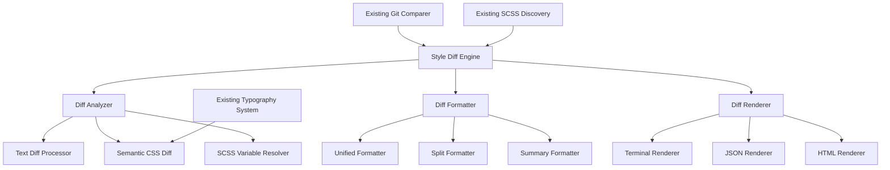
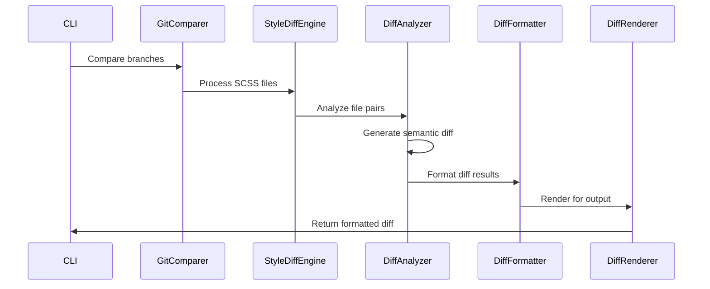
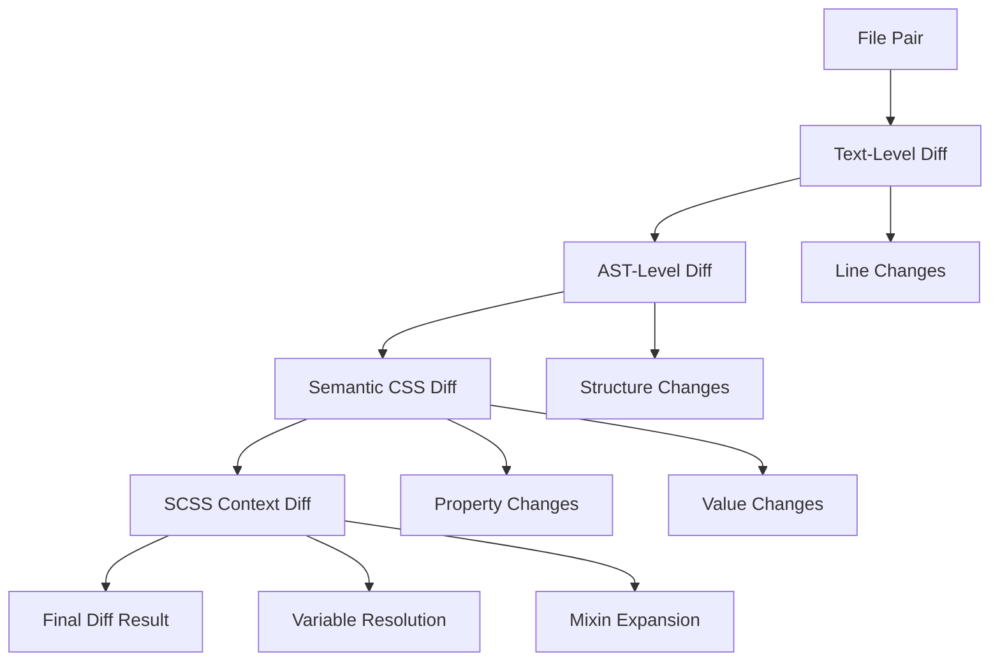

## Overview

This specification outlines the implementation of a Style Diff Engine that provides precise, 
semantic differences between SCSS files across Git branches. 
The engine will integrate with the existing NoStyleDrifting architecture to deliver meaningful, contextual style comparisons for code reviewers.

## 1. Requirements Analysis

### Functional Requirements

1. **Line-by-Line SCSS Diff Generation**
   - Generate precise diffs between SCSS files from different branches
   - Support semantic CSS/SCSS property comparison
   - Handle SCSS-specific syntax (variables, mixins, nesting)

2. **Change Highlighting**
   - Visually distinguish added, removed, and modified properties
   - Support color-coded output for terminal display
   - Provide clear visual indicators for different change types

3. **Change Grouping**
   - Group related CSS properties together (e.g., margin, padding)
   - Organize changes by selectors and media queries
   - Maintain logical grouping for better readability

4. **Before/After Value Display**
   - Show clear before and after values for modified properties
   - Handle SCSS variable resolution for meaningful comparisons
   - Display computed values alongside variable references

5. **Context Preservation**
   - Maintain selector context around changes
   - Show surrounding code for better understanding
   - Preserve file structure and nesting hierarchy

6. **Multiple View Modes**
   - Unified diff view (traditional git-style)
   - Split diff view (side-by-side comparison)
   - Summary view (high-level changes only)

### Non-Functional Requirements

1. **Performance**: Handle large SCSS files efficiently
2. **Accuracy**: Provide semantic, not just textual differences
3. **Integration**: Seamlessly integrate with existing CLI structure
4. **Extensibility**: Support future diff algorithms and formats

## 2. Technical Architecture

### Component Structure



### Data Flow



## 3. Implementation Specification

### 3.1 Core Components

#### StyleDiffEngine (`src/diff/style-diff-engine.ts`)

**Purpose**: Main orchestrator for style difference analysis

**Key Responsibilities**:
- Coordinate diff analysis across file pairs
- Manage diff configuration and options
- Integrate with existing Git and SCSS discovery systems

**Interface**:
```typescript
interface StyleDiffEngine {
  compareBranches(branch1: string, branch2: string, options: DiffOptions): Promise<StyleDiffResult>
  compareFiles(file1: string, file2: string, options: DiffOptions): Promise<FileDiffResult>
  compareContent(content1: string, content2: string, filePath: string): Promise<FileDiffResult>
}

interface DiffOptions {
  viewMode: 'unified' | 'split' | 'summary'
  contextLines: number
  groupRelatedChanges: boolean
  resolveVariables: boolean
  showOnlyChanges: boolean
  format: 'terminal' | 'json' | 'html'
}
```

#### DiffAnalyzer (`src/diff/diff-analyzer.ts`)

**Purpose**: Core diff analysis logic with semantic CSS understanding

**Key Responsibilities**:
- Perform line-by-line text comparison
- Apply semantic CSS/SCSS analysis
- Resolve SCSS variables for meaningful comparisons
- Group related changes logically

**Key Methods**:
```typescript
interface DiffAnalyzer {
  analyzeFiles(file1: ScssFile, file2: ScssFile): Promise<FileDiffResult>
  analyzeContent(content1: string, content2: string): Promise<DiffChunk[]>
  groupRelatedChanges(changes: DiffChange[]): Promise<DiffGroup[]>
  resolveScssContext(change: DiffChange, context: ScssContext): Promise<ResolvedChange>
}
```

**Semantic Analysis Features**:
- CSS property categorization (typography, layout, colors, etc.)
- SCSS variable resolution and tracking
- Mixin and function call analysis
- Selector specificity comparison

#### DiffFormatter (`src/diff/diff-formatter.ts`)

**Purpose**: Format diff results for different viewing modes

**Key Responsibilities**:
- Format diffs for unified, split, and summary views
- Apply consistent styling and spacing
- Handle complex SCSS syntax formatting

**Formatter Types**:
1. **UnifiedFormatter**: Traditional git-style unified diff
2. **SplitFormatter**: Side-by-side comparison
3. **SummaryFormatter**: High-level change overview

#### DiffRenderer (`src/diff/diff-renderer.ts`)

**Purpose**: Render formatted diffs for various output formats

**Key Responsibilities**:
- Terminal rendering with color support
- JSON output for programmatic consumption
- HTML output for web-based viewing

### 3.2 Data Structures

#### Core Diff Types (`src/diff/types.ts`)

```typescript
interface StyleDiffResult {
  branch1: string
  branch2: string
  fileDiffs: FileDiffResult[]
  summary: DiffSummary
  metadata: DiffMetadata
}

interface FileDiffResult {
  filePath: string
  changeType: 'added' | 'removed' | 'modified' | 'unchanged'
  chunks: DiffChunk[]
  summary: FileDiffSummary
}

interface DiffChunk {
  oldStart: number
  oldLength: number
  newStart: number
  newLength: number
  changes: DiffChange[]
  context: ChunkContext
}

interface DiffChange {
  type: 'added' | 'removed' | 'modified' | 'context'
  lineNumber: number
  content: string
  cssProperties?: CssPropertyChange[]
  scssContext?: ScssContext
}

interface CssPropertyChange {
  property: string
  oldValue?: string
  newValue?: string
  category: 'typography' | 'layout' | 'color' | 'animation' | 'other'
  impact: 'high' | 'medium' | 'low'
}

interface DiffGroup {
  category: string
  selector: string
  changes: DiffChange[]
  related: boolean
}
```

### 3.3 Integration Points

#### Integration with Git Comparer

**Modification to `git-branch-comparer.ts`**:
- Add method to return file pairs for diff analysis
- Extend temporary directory structure to support diff operations
- Add diff options to comparison configuration

#### Integration with SCSS Discovery

**Enhancement to `scss-discovery.ts`**:
- Provide file metadata for diff context
- Support file pairing across branches
- Maintain component associations for contextual diffs

#### CLI Enhancement

**Addition to `index.ts`**:
- New `--diff` flag for style diff mode
- Diff-specific options (view mode, context lines, etc.)
- Output format selection

## 4. Semantic Diff Algorithm

### 4.1 Multi-Level Diff Approach



### 4.2 Semantic Analysis Stages

1. **Text Diff**: Standard line-by-line comparison using proven diff algorithms
2. **AST Diff**: Compare SCSS abstract syntax trees for structural changes
3. **Property Diff**: Semantic comparison of CSS properties and values
4. **Context Diff**: SCSS-specific analysis (variables, mixins, nesting)

### 4.3 Change Categorization

**CSS Property Categories**:
- **Typography**: font-*, line-height, text-*, letter-spacing, etc.
- **Layout**: display, position, margin, padding, flex-*, grid-*, etc.
- **Visual**: color, background-*, border-*, box-shadow, etc.
- **Animation**: transition-*, animation-*, transform, etc.
- **Responsive**: Media query changes and breakpoint modifications

**Impact Assessment**:
- **High Impact**: Changes affecting layout, accessibility, or core functionality
- **Medium Impact**: Visual changes that might affect user experience
- **Low Impact**: Minor adjustments or code organization changes

## 5. Output Formats

### 5.1 Terminal Output

**Unified View**:
```
--- src/styles/components/button.scss (main)
+++ src/styles/components/button.scss (feature-branch)
@@ -15,7 +15,8 @@
   .primary-button {
     background-color: $primary-color;
-    padding: 8px 16px;
+    padding: 12px 20px;
     border-radius: 4px;
+    box-shadow: 0 2px 4px rgba(0,0,0,0.1);
   }
```

**Split View**:
```
main                          │ feature-branch
──────────────────────────────┼──────────────────────────────
.primary-button {             │ .primary-button {
  background-color: $primary; │   background-color: $primary;
  padding: 8px 16px;          │   padding: 12px 20px;
  border-radius: 4px;         │   border-radius: 4px;
}                             │   box-shadow: 0 2px 4px rgba(0,0,0,0.1);
                              │ }
```

### 5.2 JSON Output

```json
{
  "diffSummary": {
    "filesChanged": 3,
    "linesAdded": 12,
    "linesRemoved": 8,
    "propertiesModified": 15
  },
  "fileDiffs": [
    {
      "filePath": "src/styles/components/button.scss",
      "changeType": "modified",
      "chunks": [
        {
          "changes": [
            {
              "type": "modified",
              "property": "padding",
              "oldValue": "8px 16px",
              "newValue": "12px 20px",
              "impact": "medium",
              "category": "layout"
            }
          ]
        }
      ]
    }
  ]
}
```

## 6. Implementation Steps

### Phase 1: Core Infrastructure
1. Create diff engine directory structure
2. Implement basic diff analyzer with text-level comparison
3. Create core data structures and interfaces
4. Integrate with existing Git comparer

### Phase 2: Semantic Analysis
1. Implement AST-based diff comparison
2. Add CSS property categorization
3. Implement SCSS variable resolution in diff context
4. Add change grouping logic

### Phase 3: Formatting and Rendering
1. Implement unified diff formatter
2. Implement split diff formatter
3. Add terminal renderer with color support
4. Implement JSON output format

### Phase 4: Advanced Features
1. Add summary formatter
2. Implement HTML renderer
3. Add change impact assessment
4. Optimize performance for large files

### Phase 5: Integration and Testing
1. Update CLI interface with diff options
2. Add comprehensive unit tests
3. Add integration tests with existing components
4. Performance testing and optimization

## 7. Testing Strategy

### Unit Tests Required

1. **DiffAnalyzer Tests**:
   - Text-level diff accuracy
   - AST diff comparison
   - SCSS variable resolution
   - Change grouping logic

2. **Formatter Tests**:
   - Unified diff formatting
   - Split diff formatting
   - Summary formatting
   - Edge cases and malformed input

3. **Renderer Tests**:
   - Terminal output formatting
   - JSON output structure
   - Color coding and styling

4. **Integration Tests**:
   - End-to-end diff generation
   - Git integration workflow
   - Performance with large files

### Test Data Requirements

- Sample SCSS files with various change types
- Complex nested SCSS structures
- Files with extensive variable usage
- Large files for performance testing

## 8. Performance Considerations

### Optimization Strategies

1. **Caching**: Cache AST parsing results for repeated comparisons
2. **Streaming**: Process large files in chunks to manage memory
3. **Parallel Processing**: Compare multiple file pairs concurrently
4. **Smart Diffing**: Skip unchanged sections quickly

### Memory Management

- Implement streaming for large file processing
- Use efficient diff algorithms (Myers algorithm or similar)
- Clean up temporary data structures promptly
- Monitor memory usage during batch operations

## 9. Error Handling

### Error Scenarios

1. **Malformed SCSS**: Handle syntax errors gracefully
2. **Large Files**: Prevent memory exhaustion
3. **Git Conflicts**: Handle merge conflicts in files
4. **Variable Resolution**: Handle circular dependencies

### Recovery Strategies

- Fallback to text-only diff for problematic files
- Provide partial results when possible
- Clear error messages for troubleshooting
- Logging for debugging complex scenarios

## 10. Future Enhancements

### Potential Extensions

1. **Interactive Diff**: Terminal-based interactive diff viewer
2. **Diff Statistics**: Detailed analytics on style changes
3. **Custom Rules**: User-defined diff highlighting rules
4. **Integration**: IDE plugin support for popular editors
5. **Report Generation**: Automated diff reports for code reviews

This specification provides a comprehensive foundation for implementing the Style Diff Engine while maintaining consistency with the existing NoStyleDrifting architecture and ensuring seamless integration with current components.

Similar code found with 1 license type