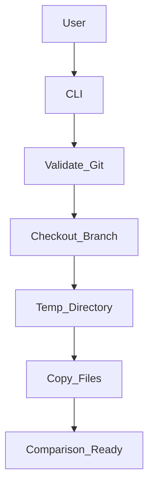
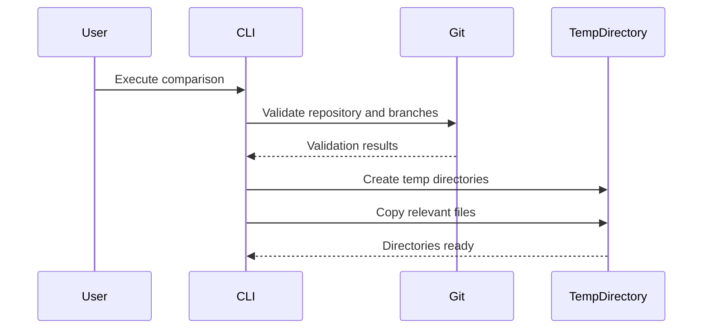

# Codebase\_Overview\.md

## 1. Project Overview

**Purpose & Goals:**

*NoStyleDrifting* is a command-line utility designed to compare Angular styles between different Git branches efficiently. It aims to detect style inconsistencies introduced primarily through AI-assisted code modifications, ensuring visual consistency and maintaining accessibility standards across branches.

**Key Features:**

* Branch comparison within Angular projects
* Temporary directory management
* Detailed verbose output
* Automated cleanup
* Quick file copying mechanism
* CLI integration

---

## 2. Technical Architecture

### System Architecture

The utility operates by:

1. Validating the Git repository and branches.
2. Temporarily checking out branches into isolated directories.
3. Copying relevant files (excluding directories like `node_modules`, `.git`, and `dist`) for comparison.
4. Optionally preserving directories post-comparison for manual inspections.

### Data Flow

* CLI invocation → Git branch validation → Temporary directories → File copying → Comparison ready.

### External Integrations

* Git via `simple-git` library

---

## 3. Codebase Structure

### Directory Structure

```
NoStyleDrifting/
├── src/
│   └── index.ts  # Main CLI logic
├── dist/         # Compiled JavaScript files
├── test/         # Unit tests
├── package.json  # Project metadata and scripts
├── tsconfig.json # TypeScript configuration
└── jest.config.js # Jest testing framework configuration
```

**Best Practices:**

* Clear separation of source (`src`), distribution (`dist`), and testing (`test`) directories.
* Comprehensive use of scripts for development, testing, and build automation.
* Well-defined TypeScript configurations ensuring type safety and consistency.

---

## 4. Key Technologies and Dependencies

### Core Technologies:

* **Node.js:** Chosen for its excellent support for asynchronous file operations and extensive library ecosystem.
* **TypeScript:** Provides type safety, easier maintenance, and robust tooling.

### Primary Libraries:

* **Commander:** CLI interface creation
* **Simple-git:** Git operations
* **fs-extra:** Enhanced file system methods
* **Chalk:** Colorized CLI output
* **UUID:** Generation of unique identifiers for temporary directories

### Testing Framework:

* **Jest:** Comprehensive testing framework for unit and integration tests.

---

## 6. Deployment and CI/CD

### Deployment Process:

* Packaged via npm (`npm install -g nostyledrifting` or local installation)
* Continuous deployment managed through npm scripts (e.g., `npm run build`, `npm run test`)

### CI/CD Pipelines:

Not explicitly detailed in the provided code but typically involves:

* Automated tests via Jest
* Compilation through TypeScript
* Distribution via npm packages

---

## 7. Mermaid Diagrams

### System Architecture Overview



### Data Flow Diagram



---

## 8. Observations and Recommendations

### Observations:

* The architecture is clean and well-organized, with clear separation of concerns.
* Excellent utilization of modern JavaScript and TypeScript best practices.
* Comprehensive error handling and verbose logging enhance usability.

### Recommendations:

* Introduce explicit CI/CD pipelines (e.g., GitHub Actions) for continuous testing and automated package deployments.
* Expand the functionality to include automated SCSS and accessibility analysis directly within the CLI.
* Incorporate detailed documentation and automated report generation features for enhanced usability in larger teams.
