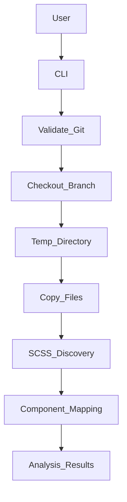
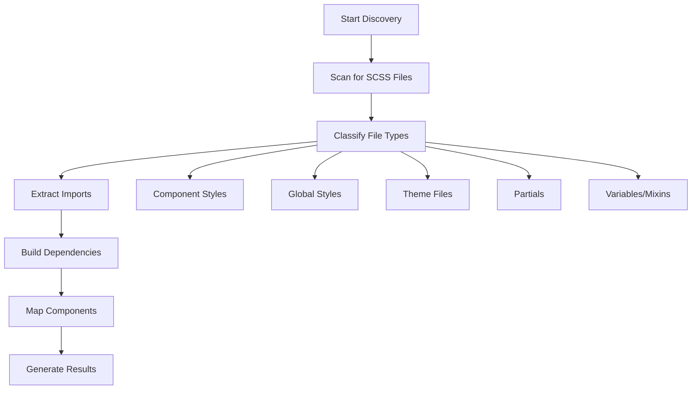
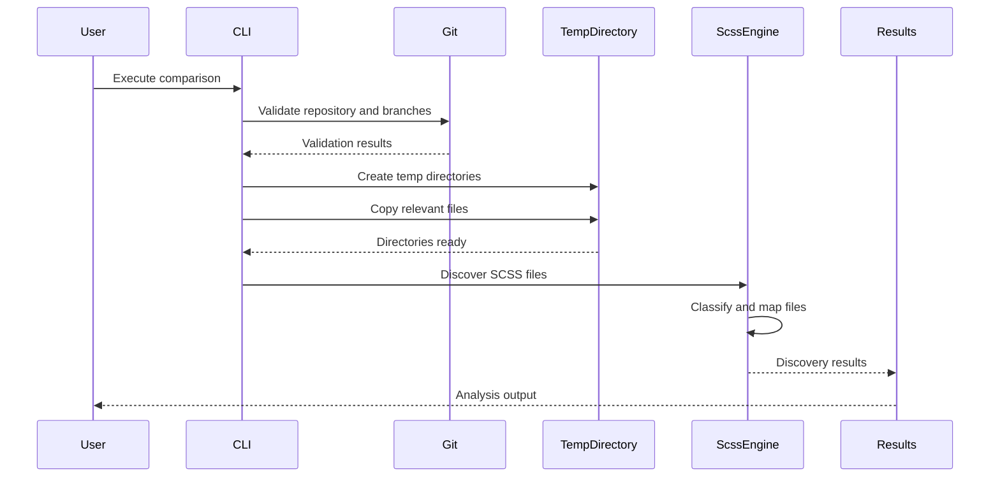

# Codebase_Overview.md

## 1. Project Overview

**Purpose & Goals:**

*NoStyleDrifting* is an advanced command-line utility designed to compare Angular styles between different Git branches efficiently. It aims to detect style inconsistencies introduced primarily through AI-assisted code modifications, ensuring visual consistency and maintaining accessibility standards across branches. The project provides a comprehensive foundation for creating intelligent style analysis tools with sophisticated typography analysis capabilities.

**Key Features:**

* **Advanced Typography Analysis**: Comprehensive typography property extraction with intelligent font stack analysis, accessibility compliance checking, and responsive design validation
* **Branch comparison** within Angular projects with full Git integration
* **SCSS file discovery and analysis** with comprehensive classification
* **Component-style mapping** for Angular components including standalone detection
* **Import dependency tracking** and resolution with circular dependency detection
* **Performance-optimized** processing with advanced caching mechanisms and concurrent processing
* **Accessibility Analysis**: WCAG compliance checking, contrast ratio validation, and readability analysis
* **Streaming extraction** for large files with memory optimization
* **Font Face Processing**: Advanced @font-face declaration analysis with loading strategy recommendations
* **Temporary directory management** with automatic cleanup
* **Multiple CLI interfaces** with both comparison and discovery commands
* **Cross-platform compatibility** with Windows, macOS, and Linux support

---

## 2. Technical Architecture

### System Architecture

The utility operates through a sophisticated multi-layered architecture designed for creating the NoStyleDrifting program foundation:

1. **CLI Layer**: Commander-based interface with multiple command modes
2. **Git Management Layer**: Branch validation, checkout, and temporary directory creation
3. **Typography Analysis Engine**: Advanced typography property extraction with performance optimization
4. **SCSS Discovery Engine**: File scanning, classification, and metadata extraction
5. **Analysis Layer**: Import resolution, dependency mapping, and component association
6. **Performance Optimization Layer**: Caching, streaming, and concurrent processing
7. **Service Layer**: High-level coordination and result aggregation

**Core Workflows:**

* **Branch Comparison**: Git validation → Temporary directories → File copying → SCSS discovery → Typography analysis → Results
* **Typography Extraction**: AST parsing → Property extraction → Variable resolution → Font analysis → Accessibility validation
* **SCSS Discovery**: File scanning → Classification → Import resolution → Component mapping → Result aggregation
* **Performance Optimization**: AST preprocessing → Concurrent processing → LRU caching → Memory management

### Advanced Typography System

The system includes a sophisticated typography analysis foundation with:

* **Multi-Engine Architecture**: Fixed extractor, streaming extractor, and analyzer components
* **Variable Resolution**: SCSS variable tracking and evaluation with dependency management
* **Media Query Analysis**: Responsive typography mapping across breakpoints
* **Font Face Processing**: Advanced @font-face declaration analysis with loading strategies
* **Accessibility Insights**: WCAG compliance, readability analysis, and contrast validation
* **Performance Optimization**: LRU caching, AST preprocessing, and concurrent processing

### Data Flow

* CLI invocation → Git branch validation → Typography analysis → SCSS discovery → Component mapping → Analysis results
* Typography workflow: AST parsing → Property extraction → Variable resolution → Font analysis → Accessibility validation
* Discovery workflow: Directory scanning → File classification → Import extraction → Dependency building → Result compilation

### External Integrations

* **Git** via `simple-git` library for repository operations
* **File System** via `fs-extra` for enhanced file operations  
* **Glob patterns** via `glob` library for efficient file scanning
* **Pattern matching** via `micromatch` for flexible file filtering

---

## 3. Codebase Structure

### Directory Structure

```
NoStyleDrifting/
├── src/
│   ├── index.ts                    # Main CLI logic and command definitions
│   ├── git-branch-comparer.ts     # Git operations and branch management
│   ├── scss-discovery.ts          # SCSS file discovery and analysis engine
│   ├── types.ts                   # TypeScript type definitions
│   ├── errors.ts                  # Custom error classes
│   ├── typography/                 # Typography analysis system
│   │   ├── index.ts               # Main Typography API with unified interface
│   │   ├── typography-extractor.ts # Original typography extractor
│   │   ├── typography-extractor-fixed.ts # Fixed typography extractor engine
│   │   ├── typography-analyzer.ts  # Advanced typography analyzer
│   │   ├── streaming-extractor.ts  # Memory-efficient streaming extractor
│   │   ├── performance-optimizer.ts # Performance optimization and caching
│   │   ├── error-handler.ts       # Typography error handling and recovery
│   │   ├── variable-resolver.ts   # SCSS variable resolution system
│   │   ├── media-query-analyzer.ts # Responsive typography analysis
│   │   ├── font-face-processor.ts # @font-face declaration processing
│   │   ├── types.ts               # Typography type definitions
│   │   └── typography.test.ts     # Typography system tests
│   ├── parser/                    # AST parsing and node definitions
│   │   └── ast-nodes.ts          # AST node type definitions
│   ├── git-branch-comparer.test.ts # Unit tests for Git operations
│   └── scss-discovery.test.ts     # Unit tests for SCSS discovery
├── dist/                           # Compiled JavaScript files
├── documentation/                  # Project documentation
│   ├── api-reference.md           # API documentation
│   ├── implementation-guide.md    # Implementation details
│   └── examples.md                # Usage examples
├── implementations/                # Implementation stories and specs
│   ├── story01.md                 # Git branch comparison implementation
│   ├── story1-1.md                # SCSS discovery detailed specs
│   └── story01-complete.md        # Complete implementation details
├── TheSteps/                      # Detailed implementation steps
│   ├── step2/                     # Typography implementation specs
│   │   └── detailspec-1-3.md     # Typography property extraction specs
│   └── step3/                     # Typography development feedback
│       └── agent-feedback-1-3.md # Implementation approach documentation
├── stories/                       # User stories and requirements
├── package.json                   # Project metadata, dependencies, and scripts
├── tsconfig.json                  # TypeScript configuration
├── jest.config.js                 # Jest testing framework configuration
└── README.md                      # Project overview and usage
```

**Best Practices:**

* **Modular Architecture**: Clear separation between Git operations, SCSS discovery, typography analysis, and CLI logic
* **Comprehensive Testing**: Unit tests for all major components with integration scenarios
* **Type Safety**: Full TypeScript coverage with detailed interface definitions for typography system
* **Error Handling**: Custom error classes with recovery strategies and detailed error statistics
* **Performance Optimization**: Advanced caching mechanisms, streaming extraction, and concurrent processing
* **Documentation**: Extensive documentation including API references, implementation guides, and detailed specifications

---

## 4. Key Technologies and Dependencies

### Core Technologies:

* **Node.js:** Chosen for its excellent support for asynchronous file operations and extensive library ecosystem.
* **TypeScript:** Provides type safety, easier maintenance, and robust tooling.

### Primary Libraries:

* **Commander:** CLI interface creation with multiple command support
* **Simple-git:** Git operations and repository management
* **fs-extra:** Enhanced file system methods with Promise support
* **Chalk:** Colorized CLI output for improved user experience
* **UUID:** Generation of unique identifiers for temporary directories
* **Glob:** Pattern-based file system scanning
* **Micromatch:** Advanced pattern matching for file filtering
* **p-limit:** Concurrency control for performance optimization

### Development Dependencies:

* **Jest:** Comprehensive testing framework for unit and integration tests
* **ts-jest:** TypeScript integration for Jest
* **@types packages:** TypeScript definitions for all dependencies
* **rimraf:** Cross-platform directory cleanup

### Testing Framework:

* **Jest:** Comprehensive testing framework with TypeScript support, coverage reporting, and disabled auto-watch mode for performance optimization

---

## 5. Key Components and Features

### Git Branch Comparer (`git-branch-comparer.ts`)

**Core Functionality:**
* **Branch Validation**: Validates Git repository and branch existence
* **Temporary Directory Management**: Creates isolated directories for branch comparison
* **Automatic Cleanup**: Handles cleanup of temporary files and directories
* **Cross-platform Support**: Works on Windows, macOS, and Linux
* **Lock File Management**: Handles Git lock files to prevent conflicts

**Key Methods:**
* `compare(branch1, branch2)`: Main comparison orchestration
* `validateGitRepository()`: Ensures valid Git repository
* `createBranchDirectory()`: Creates temporary directories
* `extractBranchToTemp()`: Copies branch files to temporary location

### Typography System (`typography/`)

**Core Components:**

#### Typography API (`typography/index.ts`)
* **Unified Interface**: Main entry point for all typography extraction operations
* **Multi-Engine Support**: Orchestrates fixed extractor, streaming extractor, and analyzer
* **Caching System**: Advanced LRU caching with performance optimization
* **Batch Processing**: Efficiently handles multiple SCSS ASTs concurrently
* **Error Recovery**: Comprehensive error handling with validation and recovery strategies

**Key Methods:**
* `extractFromAST()`: Extract typography from single SCSS AST with caching
* `extractFromMultipleASTs()`: Batch processing for multiple files
* `streamExtractFromAST()`: Memory-efficient streaming for large files
* `getRecommendations()`: Typography and accessibility recommendations

#### Typography Extractor (`typography-extractor-fixed.ts`)
* **AST Processing**: Deep traversal of SCSS abstract syntax trees
* **Property Extraction**: Identifies and extracts all typography-related properties
* **Variable Resolution**: Resolves SCSS variables to concrete values
* **Context Preservation**: Maintains selector context and source location information

#### Typography Analyzer (`typography-analyzer.ts`)
* **Font Stack Analysis**: Analyzes font families, fallbacks, and web font usage
* **Consistency Analysis**: Detects inconsistencies in typography usage patterns
* **Accessibility Analysis**: WCAG compliance checking and readability analysis
* **Responsive Analysis**: Evaluates typography across different breakpoints

**Key Features:**
* Dyslexia-friendly font detection
* Contrast ratio validation
* Fluid typography analysis
* Font loading strategy recommendations

#### Performance Optimizer (`performance-optimizer.ts`)
* **AST Optimization**: Preprocesses ASTs for faster extraction
* **LRU Caching**: Intelligent caching with automatic eviction
* **Concurrent Processing**: Worker pool for parallel processing
* **Memory Management**: Streaming extraction for large files
* **Performance Metrics**: Detailed performance reporting and optimization

**Optimization Strategies:**
* AST pruning and flattening
* Cache key generation with hashing
* Concurrency limiting with p-limit integration
* Memory usage tracking and optimization

#### Streaming Extractor (`streaming-extractor.ts`)
* **Memory Efficiency**: Processes large SCSS files without memory exhaustion
* **Chunk Processing**: Configurable chunk sizes for optimal performance
* **Async Generators**: Yields results progressively for real-time processing
* **Timeout Handling**: Prevents hanging on malformed or large files

#### Variable Resolver (`variable-resolver.ts`)
* **SCSS Variable Tracking**: Maintains variable scope and inheritance
* **Dependency Resolution**: Resolves variable dependencies across files
* **Circular Dependency Detection**: Prevents infinite resolution loops
* **Value Evaluation**: Computes final values for variables and functions

#### Media Query Analyzer (`media-query-analyzer.ts`)
* **Breakpoint Analysis**: Identifies responsive typography patterns
* **Cascade Resolution**: Understands CSS cascade across media queries
* **Viewport Simulation**: Computes effective styles for different viewport sizes
* **Gap Detection**: Identifies missing responsive typography coverage

#### Font Face Processor (`font-face-processor.ts`)
* **@font-face Declaration Analysis**: Extracts and analyzes font declarations
* **Loading Strategy Recommendations**: Provides optimal font loading strategies
* **Format Support**: Handles various font formats (woff2, woff, ttf, etc.)
* **Performance Optimization**: Recommends preload and display strategies

### SCSS Discovery Engine (`scss-discovery.ts`)

**Core Functionality:**
* **File Classification**: Automatically classifies SCSS files by type
  - Component styles (`.component.scss`)
  - Global styles (`styles.scss`, etc.)
  - Theme files (theme-related patterns)
  - Partial files (starting with `_`)
  - Variables and mixins
  - Custom styles
* **Component Mapping**: Associates SCSS files with Angular components
* **Standalone Component Detection**: Identifies standalone Angular components
* **Import Resolution**: Tracks and resolves SCSS import dependencies
* **Dependency Graph Building**: Creates import/export relationship maps
* **Performance Optimization**: Concurrent processing with configurable limits

**File Type Classifications:**
```typescript
enum ScssFileType {
  COMPONENT = 'component',    // Angular component styles
  GLOBAL = 'global',          // Application-wide styles
  THEME = 'theme',            // Theme-related files
  PARTIAL = 'partial',        // SCSS partials (start with _)
  MIXIN = 'mixin',           // Mixin definitions
  VARIABLES = 'variables',    // Variable definitions
  CUSTOM = 'custom'          // Other SCSS files
}
```

### CLI Interface (`index.ts`)

**Command Structure:**
* **Main Command**: Branch comparison with optional SCSS discovery
* **Discovery Command**: Standalone SCSS file discovery and analysis
* **Options**: Verbose mode, temporary file preservation, output formats

**Command Examples:**
```bash
# Compare branches with SCSS discovery
ng-style-compare main feature-branch --discover-scss --verbose

# Standalone SCSS discovery
ng-style-compare discover ./src --format json

# Preserve temporary directories for inspection
ng-style-compare main dev --keep-temp
```

## 6. Deployment and CI/CD

### Deployment Process:

* **NPM Distribution**: Packaged for global installation (`npm install -g nostyledrifting`)
* **Multiple CLI Aliases**: Available as `nodrift`, `ng-style-compare`, or `nostyledrifting`
* **Local Installation**: Can be installed locally in projects
* **Build Process**: TypeScript compilation to `dist/` directory via `npm run build`

### Package Configuration:

```json
{
  "bin": {
    "nodrift": "./dist/index.js",
    "ng-style-compare": "./dist/index.js", 
    "nostyledrifting": "./dist/index.js"
  },
  "scripts": {
    "build": "tsc",
    "test": "jest --watchAll=false",
    "test:watch": "jest --watch",
    "prepare": "npm run build"
  }
}
```

### CI/CD Pipelines:

Current capabilities include:
* **Automated Testing**: Jest test suite with TypeScript support
* **Build Automation**: TypeScript compilation with source maps
* **Test Coverage**: Coverage reporting with multiple output formats
* **Development Workflow**: Watch mode for continuous testing during development

**Recommended Enhancements:**
* GitHub Actions for automated testing and deployment
* Automated npm package publishing
* Cross-platform testing matrices

---

## 7. Mermaid Diagrams

### System Architecture Overview



### SCSS Discovery Workflow



### Data Flow Diagram



---

## 8. Observations and Recommendations

### Observations:

* The architecture is clean and well-organized, with clear separation of concerns.
* Excellent utilization of modern JavaScript and TypeScript best practices.
* Comprehensive error handling and verbose logging enhance usability.
* The SCSS discovery engine provides deep analysis with component mapping and import tracking.
* Performance optimizations including concurrent processing and configurable limits.
* Extensive test coverage with both unit and integration tests.
* Advanced typography analysis system with sophisticated performance optimization and caching.
* Multi-engine architecture supports different extraction strategies for varying file sizes and complexity.
* Comprehensive accessibility analysis and WCAG compliance checking capabilities.

### Recent Improvements:

* **Fixed TypeScript compilation errors** in performance-optimizer.ts with proper type imports and object structure alignment
* **Disabled Jest auto-watch mode** for improved performance in CI/CD environments
* **Enhanced Typography System** with sophisticated caching mechanisms and performance optimization
* **Streaming Extraction** capabilities for processing large SCSS files without memory exhaustion
* **Advanced Error Handling** with recovery strategies and detailed error statistics
* **Performance Metrics** collection and reporting for optimization insights

### Recommendations:

* Introduce explicit CI/CD pipelines (e.g., GitHub Actions) for continuous testing and automated package deployments.
* Expand the functionality to include automated SCSS and accessibility analysis directly within the CLI.
* Incorporate detailed documentation and automated report generation features for enhanced usability in larger teams.
* Consider adding caching mechanisms for repeated discoveries on unchanged files.
* Implement change detection algorithms to identify specific style differences between branches.
* Add support for CSS-in-JS and other styling approaches beyond SCSS.
