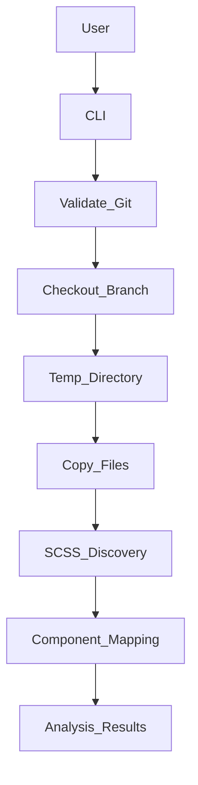
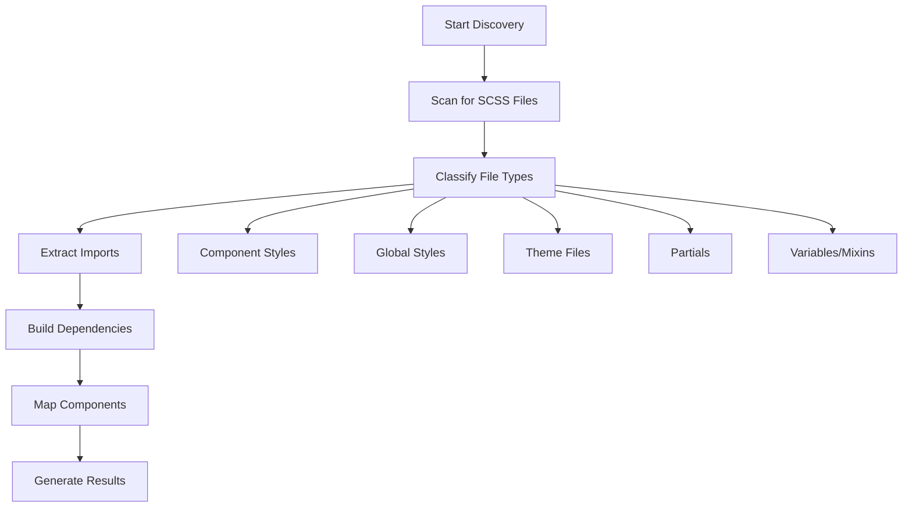
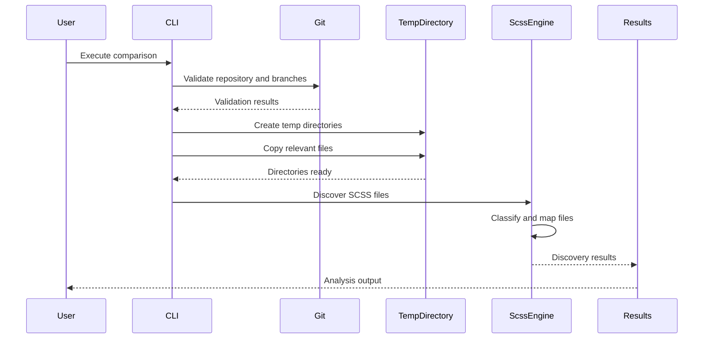

# Codebase\_Overview\.md

## 1. Project Overview

**Purpose & Goals:**

*NoStyleDrifting* is a command-line utility designed to compare Angular styles between different Git branches efficiently. It aims to detect style inconsistencies introduced primarily through AI-assisted code modifications, ensuring visual consistency and maintaining accessibility standards across branches.

**Key Features:**

* **Branch comparison** within Angular projects with full Git integration
* **SCSS file discovery and analysis** with comprehensive classification
* **Component-style mapping** for Angular components including standalone detection
* **Import dependency tracking** and resolution with circular dependency detection
* **Temporary directory management** with automatic cleanup
* **Multiple CLI interfaces** with both comparison and discovery commands
* **Performance-optimized** processing with concurrency control
* **Detailed verbose output** and error reporting
* **Cross-platform compatibility** with Windows, macOS, and Linux support

---

## 2. Technical Architecture

### System Architecture

The utility operates through a multi-layered architecture:

1. **CLI Layer**: Commander-based interface with multiple command modes
2. **Git Management Layer**: Branch validation, checkout, and temporary directory creation
3. **SCSS Discovery Engine**: File scanning, classification, and metadata extraction
4. **Analysis Layer**: Import resolution, dependency mapping, and component association
5. **Service Layer**: High-level coordination and result aggregation

**Core Workflows:**

* **Branch Comparison**: Git validation → Temporary directories → File copying → SCSS discovery → Analysis
* **SCSS Discovery**: File scanning → Classification → Import resolution → Component mapping → Result aggregation
* **Performance Optimization**: Concurrent processing, memory management, and error handling

### Data Flow

* CLI invocation → Git branch validation → Temporary directories → File copying → SCSS discovery → Component mapping → Analysis results
* Discovery workflow: Directory scanning → File classification → Import extraction → Dependency building → Result compilation

### External Integrations

* **Git** via `simple-git` library for repository operations
* **File System** via `fs-extra` for enhanced file operations  
* **Glob patterns** via `glob` library for efficient file scanning
* **Pattern matching** via `micromatch` for flexible file filtering

---

## 3. Codebase Structure

### Directory Structure

```
NoStyleDrifting/
├── src/
│   ├── index.ts                    # Main CLI logic and command definitions
│   ├── git-branch-comparer.ts     # Git operations and branch management
│   ├── scss-discovery.ts          # SCSS file discovery and analysis engine
│   ├── types.ts                   # TypeScript type definitions
│   ├── errors.ts                  # Custom error classes
│   ├── git-branch-comparer.test.ts # Unit tests for Git operations
│   └── scss-discovery.test.ts     # Unit tests for SCSS discovery
├── dist/                           # Compiled JavaScript files
├── documentation/                  # Project documentation
│   ├── api-reference.md           # API documentation
│   ├── implementation-guide.md    # Implementation details
│   └── examples.md                # Usage examples
├── implementations/                # Implementation stories and specs
│   ├── story01.md                 # Git branch comparison implementation
│   ├── story1-1.md                # SCSS discovery detailed specs
│   └── story01-complete.md        # Complete implementation details
├── stories/                       # User stories and requirements
├── package.json                   # Project metadata, dependencies, and scripts
├── tsconfig.json                  # TypeScript configuration
├── jest.config.js                 # Jest testing framework configuration
└── README.md                      # Project overview and usage
```

**Best Practices:**

* **Modular Architecture**: Clear separation between Git operations, SCSS discovery, and CLI logic
* **Comprehensive Testing**: Unit tests for all major components with integration scenarios
* **Type Safety**: Full TypeScript coverage with detailed interface definitions
* **Error Handling**: Custom error classes with specific error types and detailed messaging
* **Documentation**: Extensive documentation including API references and implementation guides

---

## 4. Key Technologies and Dependencies

### Core Technologies:

* **Node.js:** Chosen for its excellent support for asynchronous file operations and extensive library ecosystem.
* **TypeScript:** Provides type safety, easier maintenance, and robust tooling.

### Primary Libraries:

* **Commander:** CLI interface creation with multiple command support
* **Simple-git:** Git operations and repository management
* **fs-extra:** Enhanced file system methods with Promise support
* **Chalk:** Colorized CLI output for improved user experience
* **UUID:** Generation of unique identifiers for temporary directories
* **Glob:** Pattern-based file system scanning
* **Micromatch:** Advanced pattern matching for file filtering
* **p-limit:** Concurrency control for performance optimization

### Development Dependencies:

* **Jest:** Comprehensive testing framework for unit and integration tests
* **ts-jest:** TypeScript integration for Jest
* **@types packages:** TypeScript definitions for all dependencies
* **rimraf:** Cross-platform directory cleanup

### Testing Framework:

* **Jest:** Comprehensive testing framework with TypeScript support, coverage reporting, and watch mode

---

## 5. Key Components and Features

### Git Branch Comparer (`git-branch-comparer.ts`)

**Core Functionality:**
* **Branch Validation**: Validates Git repository and branch existence
* **Temporary Directory Management**: Creates isolated directories for branch comparison
* **Automatic Cleanup**: Handles cleanup of temporary files and directories
* **Cross-platform Support**: Works on Windows, macOS, and Linux
* **Lock File Management**: Handles Git lock files to prevent conflicts

**Key Methods:**
* `compare(branch1, branch2)`: Main comparison orchestration
* `validateGitRepository()`: Ensures valid Git repository
* `createBranchDirectory()`: Creates temporary directories
* `extractBranchToTemp()`: Copies branch files to temporary location

### SCSS Discovery Engine (`scss-discovery.ts`)

**Core Functionality:**
* **File Classification**: Automatically classifies SCSS files by type
  - Component styles (`.component.scss`)
  - Global styles (`styles.scss`, etc.)
  - Theme files (theme-related patterns)
  - Partial files (starting with `_`)
  - Variables and mixins
  - Custom styles
* **Component Mapping**: Associates SCSS files with Angular components
* **Standalone Component Detection**: Identifies standalone Angular components
* **Import Resolution**: Tracks and resolves SCSS import dependencies
* **Dependency Graph Building**: Creates import/export relationship maps
* **Performance Optimization**: Concurrent processing with configurable limits

**File Type Classifications:**
```typescript
enum ScssFileType {
  COMPONENT = 'component',    // Angular component styles
  GLOBAL = 'global',          // Application-wide styles
  THEME = 'theme',            // Theme-related files
  PARTIAL = 'partial',        // SCSS partials (start with _)
  MIXIN = 'mixin',           // Mixin definitions
  VARIABLES = 'variables',    // Variable definitions
  CUSTOM = 'custom'          // Other SCSS files
}
```

### CLI Interface (`index.ts`)

**Command Structure:**
* **Main Command**: Branch comparison with optional SCSS discovery
* **Discovery Command**: Standalone SCSS file discovery and analysis
* **Options**: Verbose mode, temporary file preservation, output formats

**Command Examples:**
```bash
# Compare branches with SCSS discovery
ng-style-compare main feature-branch --discover-scss --verbose

# Standalone SCSS discovery
ng-style-compare discover ./src --format json

# Preserve temporary directories for inspection
ng-style-compare main dev --keep-temp
```

## 6. Deployment and CI/CD

### Deployment Process:

* **NPM Distribution**: Packaged for global installation (`npm install -g nostyledrifting`)
* **Multiple CLI Aliases**: Available as `nodrift`, `ng-style-compare`, or `nostyledrifting`
* **Local Installation**: Can be installed locally in projects
* **Build Process**: TypeScript compilation to `dist/` directory via `npm run build`

### Package Configuration:

```json
{
  "bin": {
    "nodrift": "./dist/index.js",
    "ng-style-compare": "./dist/index.js", 
    "nostyledrifting": "./dist/index.js"
  },
  "scripts": {
    "build": "tsc",
    "test": "jest",
    "test:watch": "jest --watch",
    "prepare": "npm run build"
  }
}
```

### CI/CD Pipelines:

Current capabilities include:
* **Automated Testing**: Jest test suite with TypeScript support
* **Build Automation**: TypeScript compilation with source maps
* **Test Coverage**: Coverage reporting with multiple output formats
* **Development Workflow**: Watch mode for continuous testing during development

**Recommended Enhancements:**
* GitHub Actions for automated testing and deployment
* Automated npm package publishing
* Cross-platform testing matrices

---

## 7. Mermaid Diagrams

### System Architecture Overview



### SCSS Discovery Workflow



### Data Flow Diagram



---

## 8. Observations and Recommendations

### Observations:

* The architecture is clean and well-organized, with clear separation of concerns.
* Excellent utilization of modern JavaScript and TypeScript best practices.
* Comprehensive error handling and verbose logging enhance usability.
* The SCSS discovery engine provides deep analysis with component mapping and import tracking.
* Performance optimizations including concurrent processing and configurable limits.
* Extensive test coverage with both unit and integration tests.

### Recommendations:

* Introduce explicit CI/CD pipelines (e.g., GitHub Actions) for continuous testing and automated package deployments.
* Expand the functionality to include automated SCSS and accessibility analysis directly within the CLI.
* Incorporate detailed documentation and automated report generation features for enhanced usability in larger teams.
* Consider adding caching mechanisms for repeated discoveries on unchanged files.
* Implement change detection algorithms to identify specific style differences between branches.
* Add support for CSS-in-JS and other styling approaches beyond SCSS.
